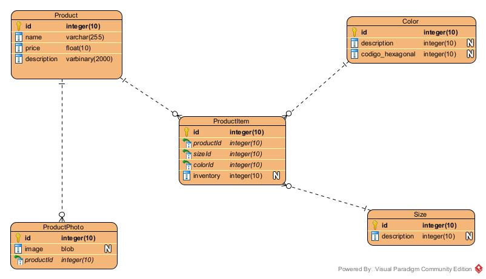

# Desafio Desenvolvedor Fullstack Senior

Desafio é construir uma aplicação com o objetivo de gerenciar os produtos de
uma loja e mostrá-los para os clientes.


<br/>

---

### <p id='tecnology'>🖥 Stacks utilizadas para o desafio</p>


 
 

<br/>

<details>
  <summary>Backend</summary>

-   [PHP](https://www.php.net/)
-   [MYSQL](https://www.mysql.com/)
-   [Laravel](https://laravel.com/docs/8.x/)
-   [Eloquent ORM](https://laravel.com/docs/8.x/eloquent/)
-   [Laravel Sanctum](https://laravel.com/docs/8.x/sanctum/)

</details>

<details>
  <summary>Frontend</summary>

-   [React](https://pt-br.reactjs.org/)
-   [Typescript](https://www.typescriptlang.org/)
-   [Axios](https://www.npmjs.com/package/axios)
-   [Styled Components](https://styled-components.com/)

</details>
<br/>

---

### <p id='estrutura'>📂 Estrutura do Desafio </p>

<ul>
    <li>📂 api (Back-end)</li>
    <li>📂 web - (Front-end)</li>
</ul>
<br/>

---

### <p id='modelo'>📃 Modelo Lógico do Banco de Dados</p>

<p align="center">
  
</p>

<br/>

---

## 🚀 Como executar

### Requisitos

Para executar o desafio, você precisará de:

* [Git](https://git-scm.com)
* [PHP](https://www.php.net/)
* [Composer](https://getcomposer.org/)
* [Node](https://nodejs.org/)
* [Yarn](https://yarnpkg.com/) 

### Backend
Clone o repositório e instale as dependências.
```bash
# clone o repository
$ git clone https://github.com/rafaelgonzagag/houpa.git

# vá para a pasta api
$ cd houpa/api

# instale as dependências da API
$ composer install

# copie o arquivo env de exemplo e faça as alterações de configuração necessárias no arquivo .env
$ cp .env.example .env

# gere uma nova chave do application key
$ php artisan key:generate

# execute as migrações do banco de dados (Defina a conexão do banco de dados em .env antes de migrar)
$ php artisan migrate --seed

# inicie o servidor de desenvolvimento local
$ php artisan serve

```

A collection do Insomina da API
<a href="Insomnia_houpaAPI.json">Link</a>

Dump do banco de dados
<a href="dump-houpa.sql">Link</a>
### Frontend
Em outra aba do terminal

```bash
# vá para a pasta web
$ cd frontend

# instale as dependências do frontend
$ yarn

# execute-o
$ yarn start
```

---

### Obrigado!
Agradeço pela oportunidade de poder realizar este desafio e os feedbaks são bem-vindo!. 